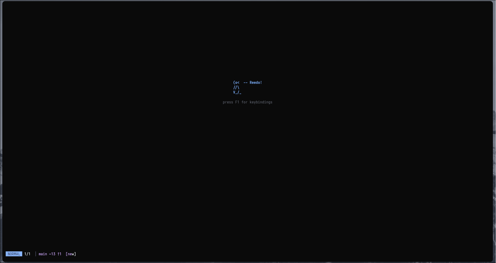
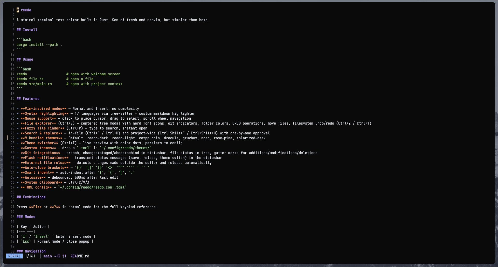
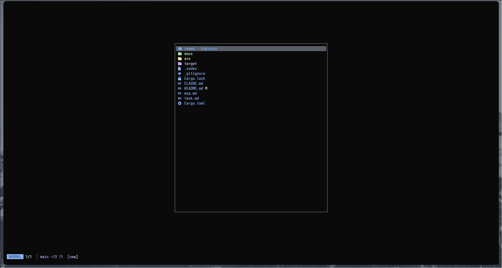

<div align="center">


# reedo

A minimal terminal text editor built in Rust.

Fast to open, focused to use, and opinionated enough to stay out of your way.

Created by [@guiwohl](https://github.com/guiwohl)

</div>

reedo is a single-binary TUI editor for people who want a cleaner workflow than a full IDE, but more structure than a bare terminal prompt. It combines modal editing, project navigation, search and replace, git context, and theme support in a compact terminal-first interface.

## Why reedo

- Minimal by design: one focused editor, one clear workflow, no tabs or plugin sprawl
- Fast to grasp: normal mode and insert mode, with practical shortcuts and on-screen help
- Project-aware: file tree, fuzzy finder, project search, project replace, and git status
- Pleasant in the terminal: mouse support, live theme switching, syntax highlighting, and a simple welcome screen
- Configurable without ceremony: TOML config plus drop-in custom themes

## Highlights

- Vim-inspired modes with clean, limited surface area
- Syntax highlighting for 17 languages via tree-sitter plus custom Markdown highlighting
- File explorer with Nerd Font icons, git indicators, CRUD operations, and filesystem undo/redo
- Fuzzy file finder, in-file search, in-file replace, project search, and project replace
- 9 bundled themes including `Default`, which can inherit terminal default colors
- Live theme switcher with persistence to config
- Autosave, system clipboard support, mouse selection, and external file reload detection

## Screenshots

<table>
  <tr>
    <td align="center">
      
      <br />
      <strong>Landing screen</strong>
    </td>
    <td align="center">
      
      <br />
      <strong>Editor</strong>
    </td>
    <td align="center">
      
      <br />
      <strong>File tree</strong>
    </td>
  </tr>
</table>

## Installation

### Requirements

- Rust toolchain with `cargo`
- `git` if you want branch and diff gutter information inside the UI
- A terminal with Unicode and 256-color support; truecolor is recommended
- A Nerd Font if you want the file tree icons to render cleanly

Optional on Linux:

- `wl-clipboard` on Wayland for clipboard integration
- `xclip` or `xsel` on X11 for clipboard integration

### Rust setup

Cross-distro:

```bash
curl --proto '=https' --tlsv1.2 -sSf https://sh.rustup.rs | sh
source "$HOME/.cargo/env"
rustup default stable
```

Ubuntu / Debian:

```bash
sudo apt update
sudo apt install -y git build-essential pkg-config rustc cargo
```

Fedora:

```bash
sudo dnf install -y git gcc pkgconf rust cargo
```

Arch Linux:

```bash
sudo pacman -S --needed git base-devel rustup
rustup default stable
```

openSUSE:

```bash
sudo zypper install -y git gcc pkg-config rust cargo
```

### Install reedo

```bash
git clone https://github.com/guiwohl/reedo.git
cd reedo
cargo install --path .
```

## Basic usage

```bash
reedo
reedo file.rs
reedo src/main.rs
```

## Documentation

Use the README as the landing page. Everything more detailed lives in `docs/`.

| Topic | Link |
|---|---|
| Configuration | [docs/configuration.md](docs/configuration.md) |
| Theming | [docs/theming.md](docs/theming.md) |
| Keybindings | [docs/keybindings.md](docs/keybindings.md) |
| File explorer | [docs/file-explorer.md](docs/file-explorer.md) |
| Git integration | [docs/git-integration.md](docs/git-integration.md) |
| Syntax highlighting | [docs/syntax-highlighting.md](docs/syntax-highlighting.md) |
| Architecture | [docs/architecture.md](docs/architecture.md) |
| Dev mode | [docs/dev-mode.md](docs/dev-mode.md) |

## License

MIT
